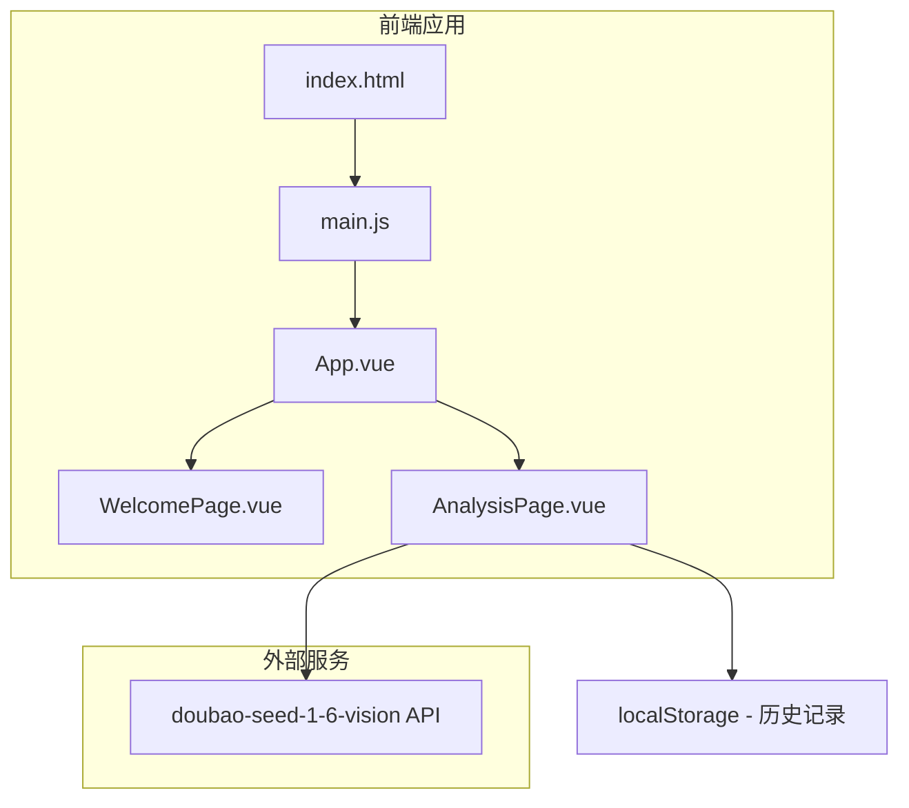

# 设计文档

## 概述

本项目是一个基于 Vue3 的摄影图片分析单页应用（SPA），采用简洁的文件结构，通过调用豆包 doubao-seed-1-6-vision 视觉模型对摄影图片进行专业分析。应用包含欢迎页和应用页两个视图，使用 Vue Router 进行页面切换，使用 localStorage 存储历史记录。

## 架构



## 组件与接口

### 文件结构

```
project/
├── index.html          # 入口HTML
├── src/
│   ├── main.js         # Vue应用入口
│   ├── App.vue         # 根组件
│   ├── views/
│   │   ├── WelcomePage.vue    # 欢迎页面
│   │   └── AnalysisPage.vue   # 应用页面
│   └── utils/
│       └── api.js      # API调用工具
├── style.css           # 全局样式
└── CODE_ANALYSIS.md    # 代码解析文档
```

### 组件说明

#### 1. WelcomePage.vue
- **背景轮播**: 使用 CSS transition 实现淡入淡出效果
- **工具栏**: 可配置的快捷方式数组
- **开始按钮**: 半透明样式，点击跳转应用页

#### 2. AnalysisPage.vue
- **图片上传**: 支持拖拽和点击上传
- **分析展示**: 原图与分析图并排对比
- **历史记录**: 右上角弹出面板，24小时自动清除

#### 3. api.js
- **analyzeImage()**: 调用 doubao-seed-1-6-vision 模型
- **drawCompositionLines()**: 在 Canvas 上绘制构图辅助线

### 接口定义

#### doubao-seed-1-6-vision API 调用

```javascript
// API 请求格式
const requestBody = {
  model: "doubao-seed-1-6-vision",
  messages: [
    {
      role: "user",
      content: [
        {
          type: "image_url",
          image_url: {
            url: "data:image/jpeg;base64,{base64_image}"
          }
        },
        {
          type: "text",
          text: "请分析这张摄影图片的：1.构图（识别构图类型并给出辅助线坐标）2.光线 3.色彩 4.主体表达 5.景别与角度。请以JSON格式返回结果。"
        }
      ]
    }
  ]
}
```

#### 分析结果数据结构

```typescript
interface AnalysisResult {
  composition: {
    type: string;           // 构图类型：三分法、对角线、中心构图等
    lines: CompositionLine[]; // 构图辅助线坐标
    description: string;    // 构图分析文字
  };
  lighting: string;         // 光线分析
  color: string;            // 色彩分析
  subject: string;          // 主体表达分析
  perspective: string;      // 景别与角度分析
}

interface CompositionLine {
  startX: number;  // 起点X坐标（百分比 0-100）
  startY: number;  // 起点Y坐标（百分比 0-100）
  endX: number;    // 终点X坐标（百分比 0-100）
  endY: number;    // 终点Y坐标（百分比 0-100）
  color: string;   // 线条颜色
}
```

## 数据模型

### 历史记录存储结构

```typescript
interface HistoryRecord {
  id: string;              // 唯一标识
  timestamp: number;       // 创建时间戳
  imageData: string;       // 原图 base64
  analysisImage: string;   // 分析图 base64
  result: AnalysisResult;  // 分析结果
}

// localStorage key: 'photo_analysis_history'
// 存储格式: JSON.stringify(HistoryRecord[])
```

### 工具栏配置结构

```typescript
interface ToolbarItem {
  name: string;    // 显示名称
  icon: string;    // 图标URL或emoji
  url: string;     // 跳转链接
}

// 在 WelcomePage.vue 中配置
const toolbarItems: ToolbarItem[] = [
  { name: '百度', icon: '🔍', url: 'https://baidu.com' },
  // 在此添加更多快捷方式...
]
```


## 正确性属性

*属性是指在系统所有有效执行中都应保持为真的特征或行为——本质上是关于系统应该做什么的形式化陈述。属性是人类可读规范与机器可验证正确性保证之间的桥梁。*

### Property 1: 工具栏渲染完整性
*对于任意*工具栏配置数组，渲染后的DOM应包含数组中每个配置项的图标和名称
**Validates: Requirements 2.2**

### Property 2: API请求格式正确性
*对于任意*上传的图片，构造的API请求体应符合doubao-seed-1-6-vision模型的规范格式，包含正确的model字段和messages结构
**Validates: Requirements 3.1, 6.1**

### Property 3: 构图线绘制正确性
*对于任意*包含构图线坐标的分析结果，Canvas绑制函数应在正确的位置绘制所有指定的线条
**Validates: Requirements 3.2**

### Property 4: 分析结果展示完整性
*对于任意*分析结果对象，渲染的文字内容应包含构图、光线、色彩、主体表达、景别与角度全部五个分析维度
**Validates: Requirements 3.4**

### Property 5: 历史记录恢复正确性
*对于任意*存储的历史记录，选择该记录后应完整恢复原图、分析图和所有分析结果数据
**Validates: Requirements 4.3**

### Property 6: 历史记录24小时清理
*对于任意*历史记录数组，清理函数执行后应移除所有timestamp距当前时间超过24小时的记录，保留未超时的记录
**Validates: Requirements 4.4**

### Property 7: 历史记录持久化
*对于任意*新增的分析记录，保存到localStorage后重新读取应得到相同的数据
**Validates: Requirements 4.5**

### Property 8: 错误处理友好性
*对于任意*API调用错误，系统应捕获错误并显示用户可理解的错误提示，而非技术性错误信息
**Validates: Requirements 6.2**

## 错误处理

### API调用错误
- 网络错误：显示"网络连接失败，请检查网络后重试"
- API密钥错误：显示"API配置错误，请检查密钥设置"
- 模型响应超时：显示"分析超时，请稍后重试"
- 响应格式错误：显示"分析结果解析失败，请重试"

### 图片处理错误
- 图片格式不支持：显示"请上传JPG、PNG或WebP格式的图片"
- 图片过大：显示"图片大小超过限制，请压缩后重试"
- 图片读取失败：显示"图片读取失败，请重新选择"

### 历史记录错误
- localStorage不可用：降级为内存存储，提示"历史记录将在关闭页面后丢失"
- 存储空间不足：清理最旧的记录，提示"存储空间不足，已清理部分历史记录"

## 测试策略

### 单元测试
使用 Vitest 进行单元测试：
- 测试API请求构造函数
- 测试历史记录清理逻辑
- 测试构图线坐标计算

### 属性测试
使用 fast-check 进行属性测试：
- 每个属性测试运行至少100次迭代
- 测试标注格式：`**Feature: photo-analysis-app, Property {number}: {property_text}**`

### 测试覆盖范围
1. 工具栏配置渲染
2. API请求格式验证
3. 历史记录CRUD操作
4. 24小时清理逻辑
5. 错误处理流程
